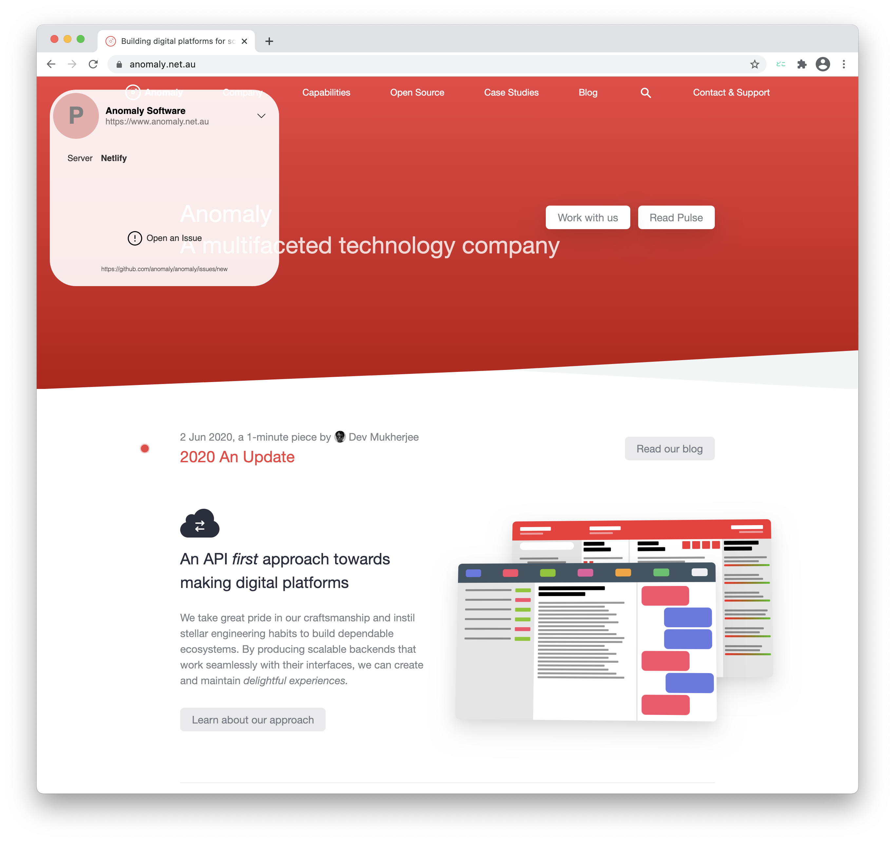

<p align="center">
  
</p>

# Doko どこ
A developer focused plugin to help identify deployment environments.

Doko provides a `meta` tag based standard for web applications to express useful information about the environment. This assists developers and testers to ensure they are accessing the right environment without having to make visual changes to the user interfaces.

In addition we provide browser plugins to overlay this information over a web interface and a set of developer tools for React.

We've proposed a [protocol](RFC.md) that web applications can use to expose the `meta` information to Doko which the plugin respects.

Doko translates to [Where](https://translate.google.com/?sl=auto&tl=en&text=doko&op=translate) in Japanese.

# Browser plugins

We provide browser extensions for Safari, Chrome and Firefox. It presents an overlay with the information for sites containing the `Doko` metatags. The widget is purely ornamental and _does not_ tamper with the application in any way. There are no dependencies or server side communication.

Please read the section about the protocol (or better still the detailed RFC) to understand how you can expose environment relevant information via Doko.

<p align="center">
  <a href="https://chrome.google.com/webstore/detail/doko/fmffffjkodhpmaghifaeejbkalikdidh">
    
  </a>
</p>

Features:
- Position the widget where it suits you best
- Show / Hide the widget as required (with a keyboard shortcut or toggle button)
- Click to reveal the three states
- Easy click through to an issue tracker



# React hook

We also provide a [React](http://reactjs.org) [hook](https://reactjs.org/docs/hooks-intro.html) to add the Doko meta tags to the document head. The source is housed in a [separate repository](https://github.com/anomaly/use-doko), the package is distributed via [npm](https://npmjs.org/package/@anomalyhq/use-doko).

You can install with `npm`:
```bash
npm install --save @anomalyhq/use-doko
```
or with `yarn`:
```bash
yarn add @anomalyhq/use-doko
```

For detailed usage refer to the [README](https://github.com/anomaly/use-doko/blob/main/README.md) in the project repository.

# The protocol

The Doko protocol is inspired by standards like [The Open Graph protocol](https://ogp.me/) to describe the meta data, required by the plugin. This is broadly classified into the following sections:

- **Environment** - containing directives for the environment being accessed
- **Abstract** - defines information displayed as an abstract
- **Facts** - facts are an unlimited set of facts about the deployment (Doko promotes a sensible limit of five objects in the interest of better user experience).
- **Feedback** - provides a mechanism to provide quick link backs to ticket systems like (but not limited to) Github issues.

```html
<meta name="doko:environment" content="production"/>
<meta name="doko:title" content="Anomaly Software"/>
<meta name="doko:subtitle" content="https://anomaly.netlifyapp.com"/>
<meta name="doko:fact" content="Server|Netlify"/>
<meta name="doko:fact" content="Database|PostgreSQL 2.0"/>
<meta name="doko:fact" content="Node|ap-01a"/>
<meta name="doko:report" content="https://github.com/anomaly/anomaly/issues/new"/>
```

Refer to [RFC-001](https://github.com/anomaly/Doko/blob/master/RFC.md) on the `master` branch for the latest definition of the protocol.

## Developer notes

The Doko plugin is built using [React](https://reactjs.org) and targets Safari, Chrome and FireFox. [Yarn](https://classic.yarnpkg.com/en/docs/getting-started) is our package manager of choice.

Build each target using the following commands:

- `yarn build` - Builds the app for Chrome production to the `build` folder.
- `yarn build:firefox`   - Builds the app for Firefox production to the `build` folder. (includes required `id` in manifest)

- `yarn zip` - Create an archive from the build directory named `Doko.zip`. The archive will be located in the dist directory

> Note: both builds build to the same directory, so do one at a time

## Getting help

We welcome feedback, ideas and code contributions. Feel free to fork the repository and open pull requests for us to consider merging back into the project.

Issues are tracked using [Github issues](https://github.com/anomaly/Doko/issues) on this repository. Feel free to open an issue. We ask you be thoughtful and provide as much information as possible using the issue template provided.

If you have a general question about how to use Doko, please open a thread in the [Discussions panel](https://github.com/anomaly/Doko/discussions)

## Contributing 

Suggesting changes to the protocol should be done by issuing pull requests to [RFC-001](https://github.com/anomaly/Doko/blob/master/RFC.md), the core team will review and merge changes where appropriate. If the changes are accepted the core team will update the `README` to make the protocol changes official.

Contributions to the plugin source are welcome. Please feel free to fork this repository and lodge pull requests for review.

## License

Doko (the protocol and plugin) are distributed under the  [Apache 2.0 License](https://www.apache.org/licenses/LICENSE-2.0). See `LICENSE` for further details.
